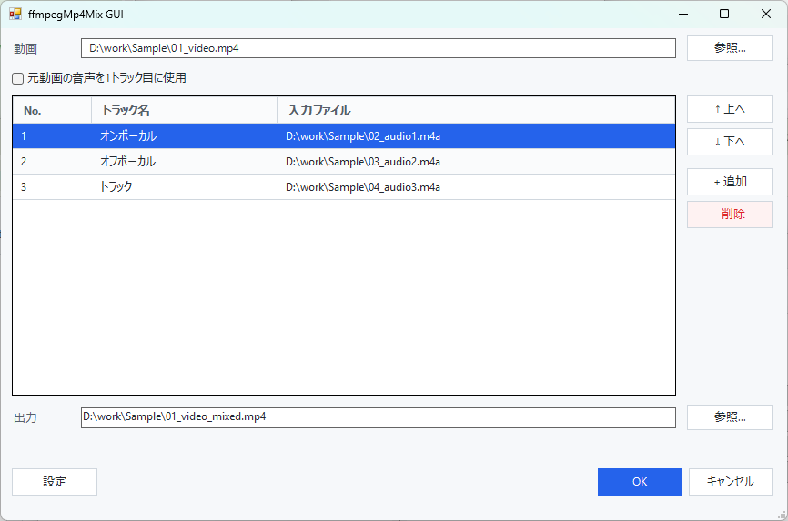
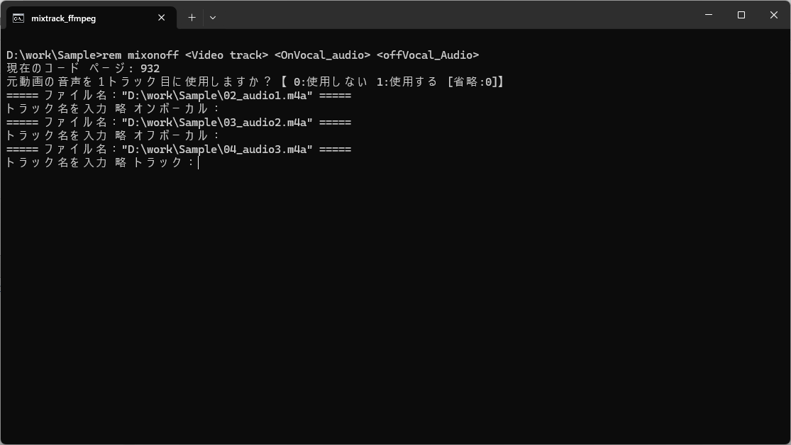

# ffmpegMp4Mix

動画ファイルと複数の音声ファイルを1つのMP4にまとめ、各音声トラックにトラック名を付けるためのWindows向けツールです。

`ffmpeg` を使って、MPC-BEなどのメディアプレイヤーで音声トラック名が分かりやすく表示されるMP4を作成します。

## できること

- 右クリックの **送る**、またはファイルのドラッグ＆ドロップで起動
- 動画ファイルが先頭でなくても、最初に見つかった `.mp4` を動画として使用
- トラック名の初期値設定
- 元動画の音声を1トラック目に使うか選択
- 出力ファイル名の接尾語を設定
- CLI版バッチでも実行可能

GUI版のみ:

- GUIで動画と音声トラックを選んで結合
- トラック名の一覧表示、編集、候補からの選択
- トラック順の変更、追加、削除

`GUI版のみ` の機能はGUI版だけで使えます。CLI版では、ファイル指定順と実行中の対話入力で処理します。

## どれを使えばいい？

| したいこと | 使うファイル |
|---|---|
| 画面で確認しながら操作したい | `mixtrack_ffmpeg_gui` |
| 少ない操作で早く済ませたい | `mixtrack_ffmpeg` |

拡張子を表示していない場合、エクスプローラー上では `.bat` や `.vbs` が見えません。
ファイルを直接ドロップする場合は、ルートにある `mixtrack_ffmpeg_gui` または `mixtrack_ffmpeg` にドロップしてください。

## 画面例

### GUI版



### CLI版



## フォルダー構成

通常使うドロップ先はルートに置き、内部ファイルは `tools` フォルダーにまとめています。

```text
ffmpegMp4Mix\
  mixtrack_ffmpeg.bat        CLI版のドロップ先
  mixtrack_ffmpeg_gui.vbs    GUI版のドロップ先
  README_ja.md
  README.md
  tools\
    ffmpeg.exe
    ffprobe.exe
    ffplay.exe
    mixtrack_ffmpeg_gui.ps1
    mixtrack_ffmpeg_gui.settings.json
    makesendto.bat
    removesendto.bat
```

`ffplay.exe` と `ffprobe.exe` は必須ではありませんが、ffmpeg配布物から一緒に置いておいても問題ありません。

## 動作環境

- Windows 10 または Windows 11
- PowerShell 5.x
- `ffmpeg.exe`

## インストール

1. GitHub Releases から `ffmpegMp4Mix_XXXXXXXX.zip` をダウンロードします。
   [GitHub Releases](https://github.com/bee7813993/ffmpegMp4Mix/releases)

2. ZIPを任意のフォルダーに展開します。

3. Windows用の `ffmpeg` を入手します。
   [ffmpeg.org](https://ffmpeg.org/download.html)

4. 入手した `ffmpeg.exe` を `tools` フォルダーにコピーします。

5. 右クリックの **送る** から使いたい場合は、`tools\makesendto` を実行します。

登録後、エクスプローラーでファイルを選択して **右クリック → 送る → mixtrack_ffmpeg_gui** または **mixtrack_ffmpeg** を選べるようになります。

送るメニューから削除したい場合は、`tools\removesendto` を実行します。

## 使い方: GUI版

GUI版では、画面上でトラック名や順番を確認しながら実行できます。

### ファイルを準備する

結合したい動画ファイルと音声ファイルを同じフォルダーに置きます。

ファイルの順番は重要です。ファイル名の先頭に番号を付けると、エクスプローラーで並べ替えやすくなり、意図した順番で渡しやすくなります。

例:

```text
01_video.mp4
02_audio1.m4a
03_audio2.m4a
```

### 送るから起動する

1. 動画ファイルと音声ファイルを選択します。
2. 右クリック → **送る → mixtrack_ffmpeg_gui** を選びます。
3. トラック一覧が表示されます。
4. 必要に応じてトラック名、順番、出力先を変更します。
5. **OK** を押すと `ffmpeg` が実行されます。

送る起動時は、渡されたファイル順がトラックの初期順になります。GUI版では、実行前に並び替えできます。

### 単体起動する

`mixtrack_ffmpeg_gui` をダブルクリックすると、ファイル指定なしで起動できます。

- 動画欄の **参照...** から動画ファイルを選択
- トラック一覧の **+ 追加** から音声ファイルを追加
- トラック一覧へ音声ファイルや動画ファイルをドラッグ＆ドロップして追加
- 動画欄へ動画ファイルをドラッグ＆ドロップして差し替え

動画欄が空の状態で複数ファイルをトラック一覧へドロップした場合、最初に見つかった `.mp4` が動画欄に入り、残りが音声トラックとして追加されます。

### トラック名を編集する

- トラック名セルを直接入力できます。
- トラック名セルをクリックすると、登録済みのトラック名候補を選択できます。
- キーボード操作では、トラック名セルで `Alt + ↑`、`Alt + ↓`、または `F4` を押すと候補を開けます。
- 候補にない名前も直接入力できます。

### トラック順を変更する

- 行をドラッグ＆ドロップして並び替えできます。
- **↑ 上へ** / **↓ 下へ** でも移動できます。
- `.mp4` のトラック行を動画欄へドロップすると、上部の動画ファイルと入れ替えできます。

### キーボードだけで操作する

起動後、`Tab`、文字入力、`Enter` だけでも実行まで進められるようにしています。

## 使い方: CLI版

CLI版は、GUIを開かずに少ない操作で素早く結合したい場合に使います。

### ファイルを準備する

結合したい動画ファイルと音声ファイルを同じフォルダーに置きます。

ファイルの順番は特に重要です。CLI版では、実行前にトラック順を並び替える画面がありません。
ファイル名の先頭に番号を付けると、エクスプローラーで並べ替えやすくなり、意図した順番で `mixtrack_ffmpeg` に渡しやすくなります。

例:

```text
01_video.mp4
02_audio1.m4a
03_audio2.m4a
```

### 起動方法

- ファイルを選択して **送る → mixtrack_ffmpeg**
- ファイルを `mixtrack_ffmpeg` にドラッグ＆ドロップ

最初に見つかった `.mp4` が動画ファイルとして扱われます。
それ以外のファイルは音声トラックとして追加されます。

ファイルの順番が重要です。音声トラックは、`mixtrack_ffmpeg` に渡された順に追加されます。

### 実行中の入力

1. 元動画の音声を1トラック目に使うか入力します。

   ```text
   0: 使用しない
   1: 使用する
   Enterのみ: 0
   ```

2. 各音声トラックのトラック名を入力します。

   何も入力せずに `Enter` を押すと、初期トラック名が使われます。

3. 完了すると、動画と同じフォルダーに `元動画名_mixed.mp4` が作成されます。

## 設定

### GUIで設定できるもの

GUIの **設定** ボタンから変更できます。

- トラック番号ごとの初期トラック名
- トラック名候補
- 番号未設定トラックの初期名
- 出力ファイル名の接尾語

GUIで保存した設定は `tools\mixtrack_ffmpeg_gui.settings.json` に保存されます。

初回起動時は、`mixtrack_ffmpeg.bat` の `TRACKNAME_1`、`TRACKNAME_2`、`TRACKNAME_3` ...、`TRACKNAME_LATER`、`OUTPUT_SUFFIX` を初期値として読み込みます。

### CLI版で設定するもの

CLI版の設定は `mixtrack_ffmpeg.bat` を編集します。

#### 元動画の音声を使うか

毎回問い合わせる代わりに固定したい場合は、`USE_VIDEO_AUDIO` を設定します。

```bat
set USE_VIDEO_AUDIO=1
```

値の意味:

- `0`: 元動画の音声を1トラック目にしない
- `1`: 元動画の音声を1トラック目にする
- 空欄: 実行時に問い合わせる

#### トラック名の初期値

```bat
set "TRACKNAME_1=オンボーカル"
set "TRACKNAME_2=オフボーカル"
set "TRACKNAME_3=歌手１ソロ"
set "TRACKNAME_4=歌手２ソロ"
set "TRACKNAME_LATER=トラック"
```

- `TRACKNAME_3`、`TRACKNAME_4` ... を追加すると、その番号の初期値になります。
- 設定されていない番号には `TRACKNAME_LATER` が使われます。

#### 出力ファイル名の接尾語

```bat
set "OUTPUT_SUFFIX=_mixed"
```

たとえば `_with_audio` にすると、出力ファイル名は `動画ファイル名_with_audio.mp4` になります。

環境変数 `OUTPUT_SUFFIX` が事前に設定されている場合は、その値が優先されます。

#### MPC-BE 1.5互換モード

MPC-BE 1.5でトラック名が重複表示される場合に使います。

```bat
set MPCBE15_COMPAT_MODE=1
```

- `0`: 通常モード
- `1`: MPC-BE 1.5向け互換モード

互換モードでは、MPC-BE 1.4や一部プレイヤーでトラック名が表示されなくなる場合があります。

## 出力結果の確認

MPC-BEなどで以下を確認してください。

- 再生中のOSD表示
- 右クリックメニューの音声トラック選択
- コントロールバーの音声言語ボタン

## よくあるトラブル

### ffmpeg.exe が見つからない

`tools\ffmpeg.exe` が存在するか確認してください。
CLI版は `tools\ffmpeg.exe` を優先し、見つからない場合はルートの `ffmpeg.exe` も探します。

### .mp4 の動画ファイルが見つからない

選択したファイルの中に `.mp4` が含まれているか確認してください。
最初に見つかった `.mp4` が動画として扱われます。

### 送るメニューが古い場所を指している

フォルダーを移動した場合は、`tools\removesendto` で古いショートカットを削除してから、`tools\makesendto` をもう一度実行してください。

### CLI版の表示が文字化けする

`mixtrack_ffmpeg.bat` はWindowsのコマンドプロンプトで安定しやすいようにShift-JIS / `chcp 932` で動作します。
PowerShellや一部ターミナル上では表示が文字化けする場合がありますが、通常のコマンドプロンプトでは読める想定です。

### トラック名がプレイヤーに表示されない

プレイヤー側の表示仕様によって異なります。
MPC-BE 1.5で重複表示される場合は、`MPCBE15_COMPAT_MODE=1` を試してください。

## 注意点

- 出力形式はMP4です。
- 映像と音声は再エンコードせず、基本的にコピーします。
- 入力ファイル名に `*`、`?`、`"`、`<`、`>` などWindowsで扱いにくい文字が含まれる場合、正常に動作しないことがあります。
- 括弧 `()` やスペースを含むファイル名には対応しています。

## 補足

これまで `L-SMASH Muxer` などで動画と音声を結合していた方向けに、より手軽にトラック名付きMP4を作れるようにしたツールです。
